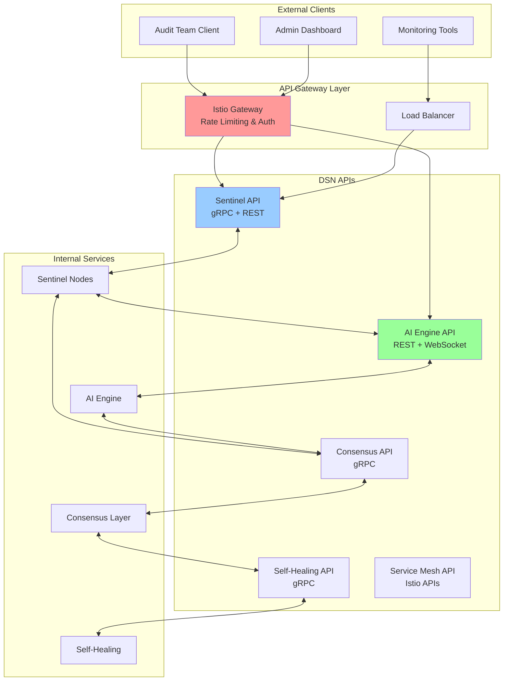
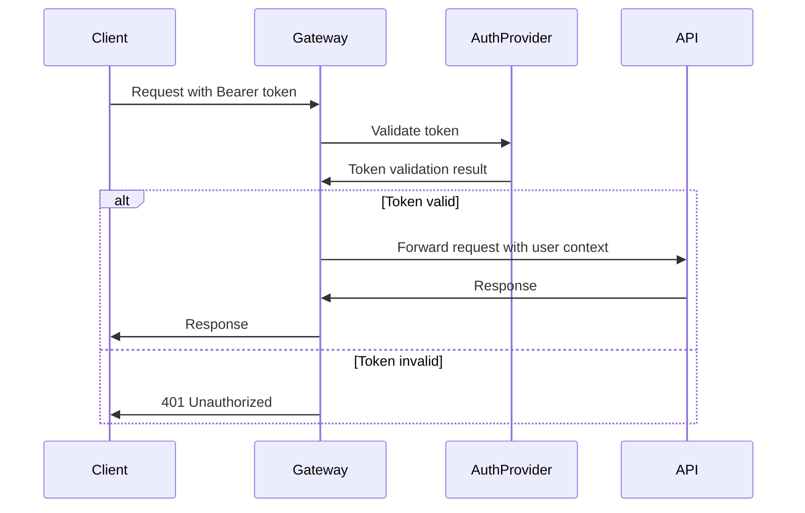

# DSN API Documentation

## Overview

The Decentralized Sentinel Network (DSN) exposes several APIs for different components. This document provides comprehensive API specifications, authentication requirements, and usage examples for all DSN services.

## API Architecture



## Authentication & Authorization

### OAuth 2.0 Flow


### API Authentication Headers
```http
Authorization: Bearer <jwt-token>
X-API-Version: v1
X-Request-ID: <unique-request-id>
Content-Type: application/json
```

### Service-to-Service Authentication
```yaml
# mTLS Configuration
apiVersion: security.istio.io/v1beta1
kind: PeerAuthentication
metadata:
  name: dsn-mtls
  namespace: dsn-system
spec:
  mtls:
    mode: STRICT
```

## Sentinel Node API

### gRPC Service Definition

```protobuf
// proto/sentinel/v1/sentinel.proto
syntax = "proto3";

package dsn.sentinel.v1;

import "google/protobuf/timestamp.proto";
import "google/protobuf/duration.proto";

service SentinelService {
  // Health and status operations
  rpc GetHealth(HealthRequest) returns (HealthResponse);
  rpc GetStatus(StatusRequest) returns (StatusResponse);
  
  // Monitoring operations
  rpc GetMetrics(MetricsRequest) returns (MetricsResponse);
  rpc StreamMetrics(MetricsRequest) returns (stream MetricsResponse);
  
  // Threat detection operations
  rpc DetectThreats(ThreatDetectionRequest) returns (ThreatDetectionResponse);
  rpc GetThreatHistory(ThreatHistoryRequest) returns (ThreatHistoryResponse);
  
  // Configuration operations
  rpc ValidateConfig(ConfigValidationRequest) returns (ConfigValidationResponse);
  rpc UpdateConfig(ConfigUpdateRequest) returns (ConfigUpdateResponse);
  
  // Audit operations
  rpc StartAudit(AuditRequest) returns (AuditResponse);
  rpc StopAudit(AuditRequest) returns (AuditResponse);
  rpc GetAuditStatus(AuditStatusRequest) returns (AuditStatusResponse);
}

// Health Check Messages
message HealthRequest {
  string component = 1;
}

message HealthResponse {
  enum Status {
    UNKNOWN = 0;
    HEALTHY = 1;
    UNHEALTHY = 2;
    DEGRADED = 3;
  }
  
  Status status = 1;
  string message = 2;
  google.protobuf.Timestamp timestamp = 3;
  map<string, string> details = 4;
}

// System Metrics Messages
message MetricsRequest {
  repeated string metric_names = 1;
  google.protobuf.Timestamp start_time = 2;
  google.protobuf.Timestamp end_time = 3;
  google.protobuf.Duration interval = 4;
}

message MetricsResponse {
  repeated Metric metrics = 1;
  google.protobuf.Timestamp timestamp = 2;
}

message Metric {
  string name = 1;
  double value = 2;
  map<string, string> labels = 3;
  string unit = 4;
}

// Threat Detection Messages
message ThreatDetectionRequest {
  string target_id = 1;
  repeated string detection_types = 2;
  ThreatDetectionConfig config = 3;
}

message ThreatDetectionResponse {
  repeated ThreatEvent threats = 1;
  ThreatSummary summary = 2;
  string scan_id = 3;
}

message ThreatEvent {
  enum Severity {
    UNKNOWN = 0;
    LOW = 1;
    MEDIUM = 2;
    HIGH = 3;
    CRITICAL = 4;
  }
  
  string id = 1;
  string type = 2;
  Severity severity = 3;
  string description = 4;
  google.protobuf.Timestamp detected_at = 5;
  string source = 6;
  map<string, string> metadata = 7;
  repeated string indicators = 8;
}

message ThreatSummary {
  int32 total_threats = 1;
  int32 critical_threats = 2;
  int32 high_threats = 3;
  int32 medium_threats = 4;
  int32 low_threats = 5;
  double risk_score = 6;
}

// Configuration Messages
message ConfigValidationRequest {
  string config_data = 1;
  string config_type = 2;
  string target_environment = 3;
}

message ConfigValidationResponse {
  bool is_valid = 1;
  repeated ValidationError errors = 2;
  repeated ValidationWarning warnings = 3;
  string validated_config = 4;
}

message ValidationError {
  string field = 1;
  string message = 2;
  string code = 3;
}

message ValidationWarning {
  string field = 1;
  string message = 2;
  string recommendation = 3;
}

// Audit Messages
message AuditRequest {
  string audit_id = 1;
  string target_system = 2;
  repeated string scan_types = 3;
  AuditConfig config = 4;
}

message AuditResponse {
  string audit_id = 1;
  string status = 2;
  google.protobuf.Timestamp started_at = 3;
  google.protobuf.Duration estimated_duration = 4;
}

message AuditConfig {
  google.protobuf.Duration timeout = 1;
  int32 max_concurrent_scans = 2;
  bool enable_deep_scan = 3;
  repeated string excluded_paths = 4;
}
```

### REST API Endpoints

#### Health & Status
```http
GET /api/v1/sentinel/health
GET /api/v1/sentinel/status
GET /api/v1/sentinel/{id}/status
```

**Example Response:**
```json
{
  "status": "HEALTHY",
  "message": "All systems operational",
  "timestamp": "2025-01-01T12:00:00Z",
  "details": {
    "cpu_usage": "45%",
    "memory_usage": "60%",
    "disk_usage": "30%",
    "network_status": "connected"
  },
  "components": [
    {
      "name": "threat_detector",
      "status": "HEALTHY",
      "last_check": "2025-01-01T11:59:30Z"
    },
    {
      "name": "config_validator",
      "status": "HEALTHY",
      "last_check": "2025-01-01T11:59:45Z"
    }
  ]
}
```

#### Metrics
```http
GET /api/v1/sentinel/metrics
GET /api/v1/sentinel/metrics?names=cpu,memory&start=2025-01-01T00:00:00Z&end=2025-01-01T23:59:59Z
```

**Example Response:**
```json
{
  "metrics": [
    {
      "name": "cpu_usage_percent",
      "value": 45.2,
      "unit": "percent",
      "labels": {
        "instance": "sentinel-001",
        "region": "us-west-2"
      }
    },
    {
      "name": "memory_usage_bytes",
      "value": 1073741824,
      "unit": "bytes",
      "labels": {
        "instance": "sentinel-001",
        "type": "resident"
      }
    }
  ],
  "timestamp": "2025-01-01T12:00:00Z"
}
```

#### Threat Detection
```http
POST /api/v1/sentinel/threats/detect
GET /api/v1/sentinel/threats/history
GET /api/v1/sentinel/threats/{threat-id}
```

**Detection Request:**
```json
{
  "target_id": "mcp-server-001",
  "detection_types": ["malware", "anomaly", "configuration"],
  "config": {
    "timeout": "300s",
    "deep_scan": true,
    "excluded_paths": ["/tmp", "/var/log"]
  }
}
```

**Detection Response:**
```json
{
  "scan_id": "scan-12345",
  "threats": [
    {
      "id": "threat-001",
      "type": "configuration_drift",
      "severity": "MEDIUM",
      "description": "Docker socket exposed without authentication",
      "detected_at": "2025-01-01T12:00:00Z",
      "source": "config_validator",
      "metadata": {
        "file_path": "/etc/docker/daemon.json",
        "expected_value": "false",
        "actual_value": "true"
      },
      "indicators": [
        "tcp://0.0.0.0:2376",
        "no_tls_verify"
      ]
    }
  ],
  "summary": {
    "total_threats": 1,
    "critical_threats": 0,
    "high_threats": 0,
    "medium_threats": 1,
    "low_threats": 0,
    "risk_score": 6.5
  }
}
```

#### Configuration Management
```http
POST /api/v1/sentinel/config/validate
PUT /api/v1/sentinel/config
GET /api/v1/sentinel/config
```

**Configuration Validation:**
```json
{
  "config_data": "{\n  \"docker_socket_enabled\": false,\n  \"tls_verify\": true\n}",
  "config_type": "docker_daemon",
  "target_environment": "production"
}
```

**Validation Response:**
```json
{
  "is_valid": true,
  "errors": [],
  "warnings": [
    {
      "field": "log_level",
      "message": "Log level not specified",
      "recommendation": "Set log_level to 'info' for production"
    }
  ],
  "validated_config": "{\n  \"docker_socket_enabled\": false,\n  \"tls_verify\": true,\n  \"log_level\": \"info\"\n}"
}
```

#### Audit Operations
```http
POST /api/v1/sentinel/audit/start
POST /api/v1/sentinel/audit/stop
GET /api/v1/sentinel/audit/{audit-id}/status
GET /api/v1/sentinel/audit/{audit-id}/results
```

**Start Audit Request:**
```json
{
  "audit_id": "audit-2025-001",
  "target_system": "mcp-cluster-prod",
  "scan_types": ["security", "compliance", "performance"],
  "config": {
    "timeout": "1800s",
    "max_concurrent_scans": 5,
    "enable_deep_scan": true,
    "excluded_paths": ["/tmp", "/var/cache"]
  }
}
```

## Consensus Layer API

### gRPC Service Definition

```protobuf
// proto/consensus/v1/consensus.proto
syntax = "proto3";

package dsn.consensus.v1;

import "google/protobuf/timestamp.proto";

service ConsensusService {
  // Ledger operations
  rpc SubmitTransaction(TransactionRequest) returns (TransactionResponse);
  rpc QueryLedger(QueryRequest) returns (QueryResponse);
  rpc GetBlockByNumber(BlockRequest) returns (BlockResponse);
  rpc GetBlockByHash(BlockHashRequest) returns (BlockResponse);
  
  // State management
  rpc GetWorldState(StateRequest) returns (StateResponse);
  rpc ValidateState(StateValidationRequest) returns (StateValidationResponse);
  
  // Threat intelligence
  rpc RecordThreat(ThreatRecord) returns (ThreatRecordResponse);
  rpc QueryThreats(ThreatQuery) returns (ThreatQueryResponse);
  rpc ShareThreatIntelligence(ThreatIntelligence) returns (ThreatIntelligenceResponse);
  
  // Network operations
  rpc GetPeerInfo(PeerInfoRequest) returns (PeerInfoResponse);
  rpc GetNetworkStatus(NetworkStatusRequest) returns (NetworkStatusResponse);
}

message TransactionRequest {
  string channel_id = 1;
  string chaincode_id = 2;
  string function_name = 3;
  repeated string args = 4;
  map<string, bytes> transient_data = 5;
}

message TransactionResponse {
  string transaction_id = 1;
  string status = 2;
  bytes payload = 3;
  string message = 4;
  google.protobuf.Timestamp timestamp = 5;
}

message ThreatRecord {
  string threat_id = 1;
  string threat_type = 2;
  string severity = 3;
  string signature = 4;
  map<string, string> metadata = 5;
  google.protobuf.Timestamp detected_at = 6;
  string source_sentinel = 7;
}

message ThreatRecordResponse {
  string record_id = 1;
  string status = 2;
  string transaction_id = 3;
}
```

### REST API Endpoints

#### Ledger Operations
```http
POST /api/v1/consensus/transactions
GET /api/v1/consensus/blocks/{block-number}
GET /api/v1/consensus/blocks/hash/{block-hash}
GET /api/v1/consensus/transactions/{tx-id}
```

#### Threat Intelligence
```http
POST /api/v1/consensus/threats
GET /api/v1/consensus/threats
GET /api/v1/consensus/threats/{threat-id}
POST /api/v1/consensus/threats/share
```

**Record Threat Request:**
```json
{
  "threat_id": "threat-001",
  "threat_type": "malware",
  "severity": "HIGH",
  "signature": "sha256:abc123...",
  "metadata": {
    "file_path": "/tmp/suspicious.exe",
    "file_size": "1024000",
    "detection_method": "signature_match"
  },
  "detected_at": "2025-01-01T12:00:00Z",
  "source_sentinel": "sentinel-001"
}
```

## AI Engine API

### REST API Endpoints

#### Threat Prediction
```http
POST /api/v1/ai/predict/threats
GET /api/v1/ai/predictions/{prediction-id}
GET /api/v1/ai/predictions/history
```

**Threat Prediction Request:**
```json
{
  "input_data": {
    "system_metrics": {
      "cpu_usage": [45.2, 46.1, 47.3, 48.0],
      "memory_usage": [60.5, 61.2, 62.1, 63.0],
      "network_traffic": [1024000, 1048576, 1073741, 1099511]
    },
    "log_patterns": [
      "Failed login attempt from 192.168.1.100",
      "Unusual process execution: /tmp/unknown.exe",
      "High CPU usage detected"
    ],
    "time_window": "300s"
  },
  "prediction_types": ["anomaly", "attack_vector", "risk_assessment"],
  "confidence_threshold": 0.8
}
```

**Prediction Response:**
```json
{
  "prediction_id": "pred-001",
  "predictions": [
    {
      "type": "anomaly",
      "confidence": 0.92,
      "description": "Unusual CPU spike pattern detected",
      "risk_level": "MEDIUM",
      "recommended_actions": [
        "Monitor process activity",
        "Check for unauthorized processes"
      ]
    },
    {
      "type": "attack_vector",
      "confidence": 0.85,
      "description": "Potential brute force attack pattern",
      "risk_level": "HIGH",
      "recommended_actions": [
        "Block suspicious IP addresses",
        "Enable account lockout policies"
      ]
    }
  ],
  "overall_risk_score": 7.5,
  "timestamp": "2025-01-01T12:00:00Z"
}
```

#### Model Management
```http
GET /api/v1/ai/models
POST /api/v1/ai/models/train
GET /api/v1/ai/models/{model-id}/status
PUT /api/v1/ai/models/{model-id}/deploy
```

#### Anomaly Detection
```http
POST /api/v1/ai/anomalies/detect
GET /api/v1/ai/anomalies/history
WebSocket: /api/v1/ai/anomalies/stream
```

### WebSocket API

#### Real-time Threat Monitoring
```javascript
// WebSocket connection for real-time threat monitoring
const ws = new WebSocket('wss://dsn.example.com/api/v1/ai/threats/stream');

ws.onopen = function() {
  // Subscribe to threat events
  ws.send(JSON.stringify({
    action: 'subscribe',
    channels: ['threats', 'anomalies', 'predictions'],
    filters: {
      severity: ['HIGH', 'CRITICAL'],
      source: ['sentinel-001', 'sentinel-002']
    }
  }));
};

ws.onmessage = function(event) {
  const data = JSON.parse(event.data);
  console.log('Threat event:', data);
  
  // Example event structure:
  // {
  //   "type": "threat_detected",
  //   "data": {
  //     "threat_id": "threat-001",
  //     "severity": "HIGH",
  //     "description": "Malware detected",
  //     "timestamp": "2025-01-01T12:00:00Z"
  //   }
  // }
};
```

## Self-Healing API

### gRPC Service Definition

```protobuf
// proto/healing/v1/healing.proto
syntax = "proto3";

package dsn.healing.v1;

service HealingService {
  // Response operations
  rpc TriggerResponse(ResponseRequest) returns (ResponseResponse);
  rpc GetResponseStatus(ResponseStatusRequest) returns (ResponseStatusResponse);
  rpc GetResponseHistory(ResponseHistoryRequest) returns (ResponseHistoryResponse);
  
  // Recovery operations
  rpc InitiateRecovery(RecoveryRequest) returns (RecoveryResponse);
  rpc ValidateRecovery(RecoveryValidationRequest) returns (RecoveryValidationResponse);
  
  // Policy management
  rpc CreateResponsePolicy(PolicyRequest) returns (PolicyResponse);
  rpc UpdateResponsePolicy(PolicyUpdateRequest) returns (PolicyResponse);
  rpc GetResponsePolicies(PolicyListRequest) returns (PolicyListResponse);
}

message ResponseRequest {
  string threat_id = 1;
  string threat_type = 2;
  string severity = 3;
  string target_system = 4;
  map<string, string> context = 5;
}

message ResponseResponse {
  string response_id = 1;
  string status = 2;
  repeated ResponseAction actions = 3;
  google.protobuf.Timestamp initiated_at = 4;
}

message ResponseAction {
  enum ActionType {
    UNKNOWN = 0;
    ISOLATE_CONTAINER = 1;
    ROTATE_CREDENTIALS = 2;
    ROLLBACK_STATE = 3;
    SCALE_RESOURCES = 4;
    BLOCK_TRAFFIC = 5;
  }
  
  ActionType type = 1;
  string target = 2;
  map<string, string> parameters = 3;
  string status = 4;
  string result = 5;
}
```

### REST API Endpoints

#### Response Management
```http
POST /api/v1/healing/responses/trigger
GET /api/v1/healing/responses/{response-id}/status
GET /api/v1/healing/responses/history
```

**Trigger Response Request:**
```json
{
  "threat_id": "threat-001",
  "threat_type": "malware",
  "severity": "HIGH",
  "target_system": "mcp-server-001",
  "context": {
    "container_id": "abc123",
    "process_id": "1234",
    "file_path": "/tmp/malware.exe"
  }
}
```

**Response Status:**
```json
{
  "response_id": "resp-001",
  "status": "IN_PROGRESS",
  "actions": [
    {
      "type": "ISOLATE_CONTAINER",
      "target": "abc123",
      "parameters": {
        "network_isolation": "true",
        "preserve_logs": "true"
      },
      "status": "COMPLETED",
      "result": "Container isolated successfully"
    },
    {
      "type": "ROTATE_CREDENTIALS",
      "target": "mcp-server-001",
      "parameters": {
        "credential_type": "api_key"
      },
      "status": "IN_PROGRESS",
      "result": ""
    }
  ],
  "initiated_at": "2025-01-01T12:00:00Z"
}
```

## Error Handling

### Standard Error Response Format
```json
{
  "error": {
    "code": "INVALID_REQUEST",
    "message": "The request is invalid",
    "details": [
      {
        "field": "target_id",
        "message": "target_id is required"
      }
    ],
    "request_id": "req-12345",
    "timestamp": "2025-01-01T12:00:00Z"
  }
}
```

### HTTP Status Codes
| Code | Description | Usage |
|------|-------------|-------|
| 200 | OK | Successful request |
| 201 | Created | Resource created successfully |
| 400 | Bad Request | Invalid request parameters |
| 401 | Unauthorized | Authentication required |
| 403 | Forbidden | Insufficient permissions |
| 404 | Not Found | Resource not found |
| 409 | Conflict | Resource conflict |
| 429 | Too Many Requests | Rate limit exceeded |
| 500 | Internal Server Error | Server error |
| 503 | Service Unavailable | Service temporarily unavailable |

### gRPC Status Codes
| Code | Description | Usage |
|------|-------------|-------|
| OK | Success | Request completed successfully |
| INVALID_ARGUMENT | Invalid argument | Request parameters invalid |
| UNAUTHENTICATED | Unauthenticated | Authentication required |
| PERMISSION_DENIED | Permission denied | Insufficient permissions |
| NOT_FOUND | Not found | Resource not found |
| ALREADY_EXISTS | Already exists | Resource already exists |
| RESOURCE_EXHAUSTED | Resource exhausted | Rate limit or quota exceeded |
| INTERNAL | Internal error | Server error |
| UNAVAILABLE | Unavailable | Service unavailable |

## Rate Limiting

### Rate Limit Headers
```http
X-RateLimit-Limit: 1000
X-RateLimit-Remaining: 999
X-RateLimit-Reset: 1640995200
X-RateLimit-Window: 3600
```

### Rate Limit Configuration
```yaml
# Rate limiting configuration
rate_limits:
  default:
    requests_per_minute: 60
    burst: 10
  
  authenticated:
    requests_per_minute: 1000
    burst: 50
  
  admin:
    requests_per_minute: 5000
    burst: 100
  
  endpoints:
    "/api/v1/sentinel/threats/detect":
      requests_per_minute: 10
      burst: 2
    
    "/api/v1/ai/predict/threats":
      requests_per_minute: 30
      burst: 5
```

## SDK Examples

### Go SDK
```go
package main

import (
    "context"
    "log"
    
    "github.com/dsn/go-sdk/sentinel"
    "google.golang.org/grpc"
)

func main() {
    // Create connection
    conn, err := grpc.Dial("dsn.example.com:443", grpc.WithInsecure())
    if err != nil {
        log.Fatal(err)
    }
    defer conn.Close()
    
    // Create client
    client := sentinel.NewSentinelServiceClient(conn)
    
    // Get health status
    health, err := client.GetHealth(context.Background(), &sentinel.HealthRequest{
        Component: "threat_detector",
    })
    if err != nil {
        log.Fatal(err)
    }
    
    log.Printf("Health status: %s", health.Status)
}
```

### Python SDK
```python
import asyncio
import grpc
from dsn.sentinel.v1 import sentinel_pb2, sentinel_pb2_grpc

async def main():
    # Create channel
    channel = grpc.aio.insecure_channel('dsn.example.com:443')
    
    # Create client
    client = sentinel_pb2_grpc.SentinelServiceStub(channel)
    
    # Detect threats
    request = sentinel_pb2.ThreatDetectionRequest(
        target_id='mcp-server-001',
        detection_types=['malware', 'anomaly']
    )
    
    response = await client.DetectThreats(request)
    
    print(f"Detected {len(response.threats)} threats")
    for threat in response.threats:
        print(f"- {threat.type}: {threat.description}")
    
    await channel.close()

if __name__ == '__main__':
    asyncio.run(main())
```

### JavaScript SDK
```javascript
const { SentinelServiceClient } = require('@dsn/js-sdk');

const client = new SentinelServiceClient('https://dsn.example.com', {
  apiKey: 'your-api-key'
});

async function detectThreats() {
  try {
    const response = await client.detectThreats({
      targetId: 'mcp-server-001',
      detectionTypes: ['malware', 'anomaly'],
      config: {
        timeout: '300s',
        deepScan: true
      }
    });
    
    console.log(`Scan ID: ${response.scanId}`);
    console.log(`Threats found: ${response.threats.length}`);
    
    response.threats.forEach(threat => {
      console.log(`- ${threat.type} (${threat.severity}): ${threat.description}`);
    });
  } catch (error) {
    console.error('Error detecting threats:', error);
  }
}

detectThreats();
```

This comprehensive API documentation provides all the necessary information for integrating with the DSN system, including detailed specifications, examples, and best practices for each component.