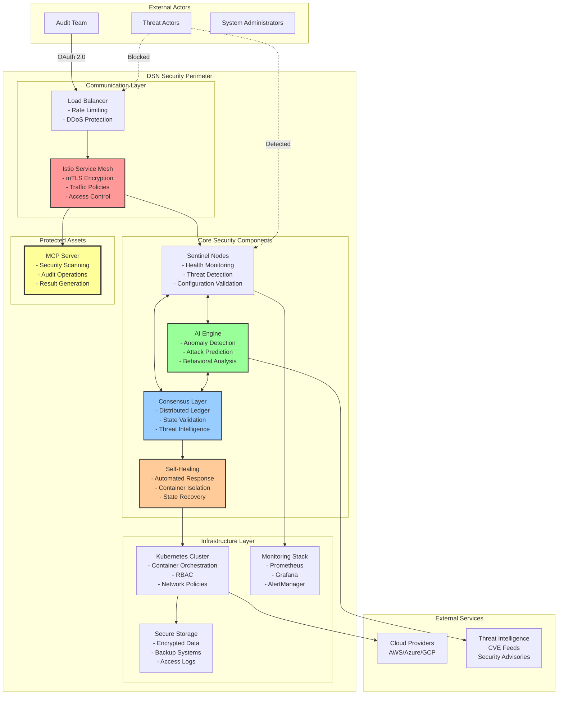
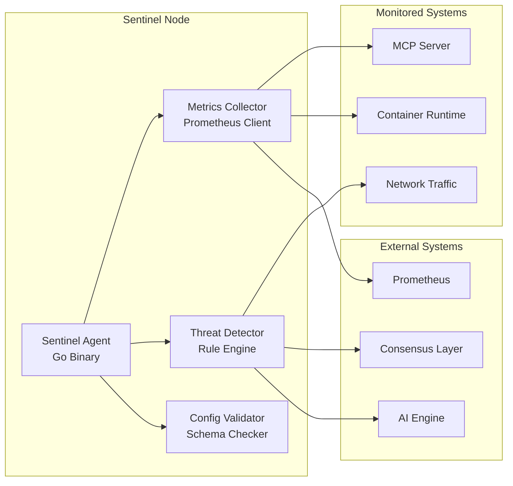
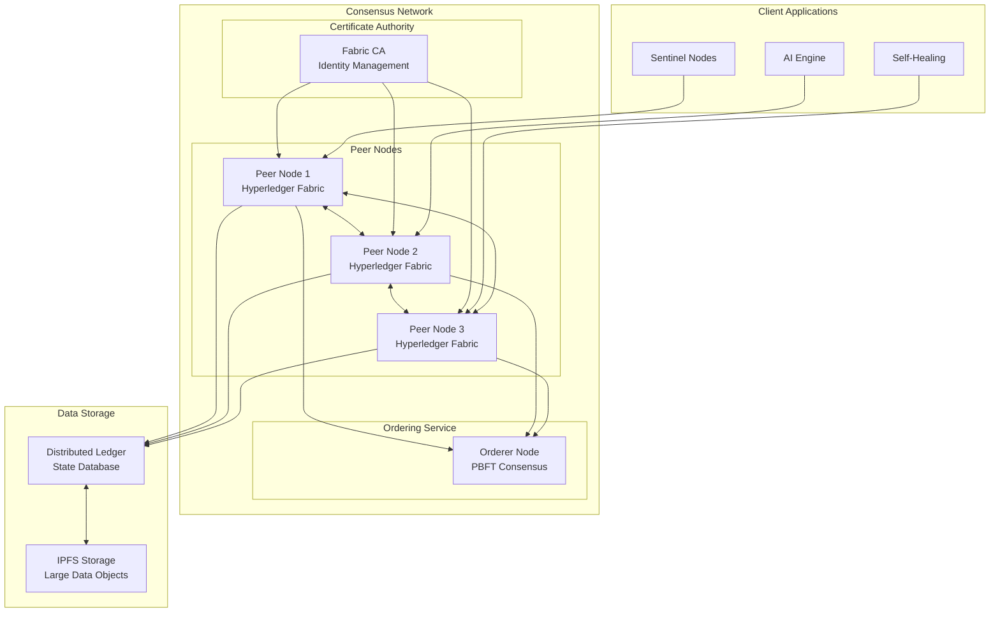
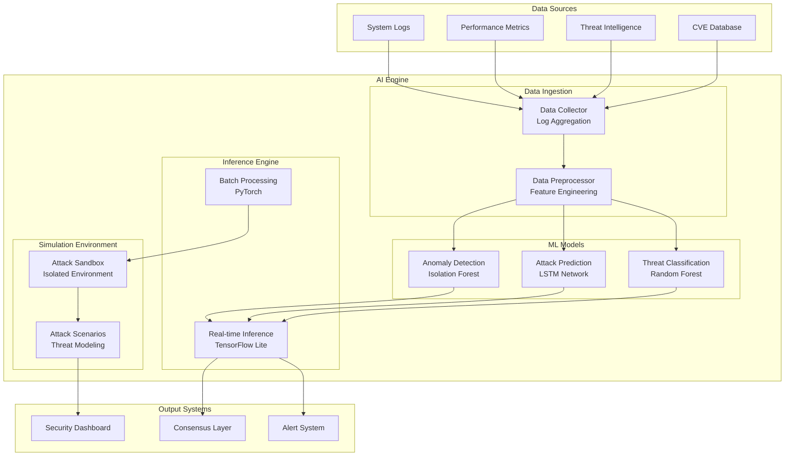
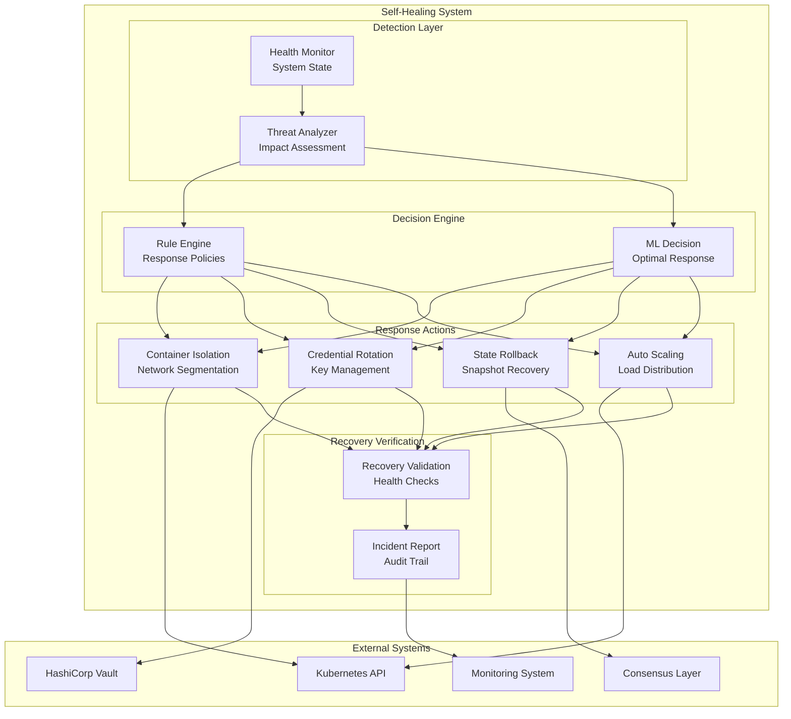
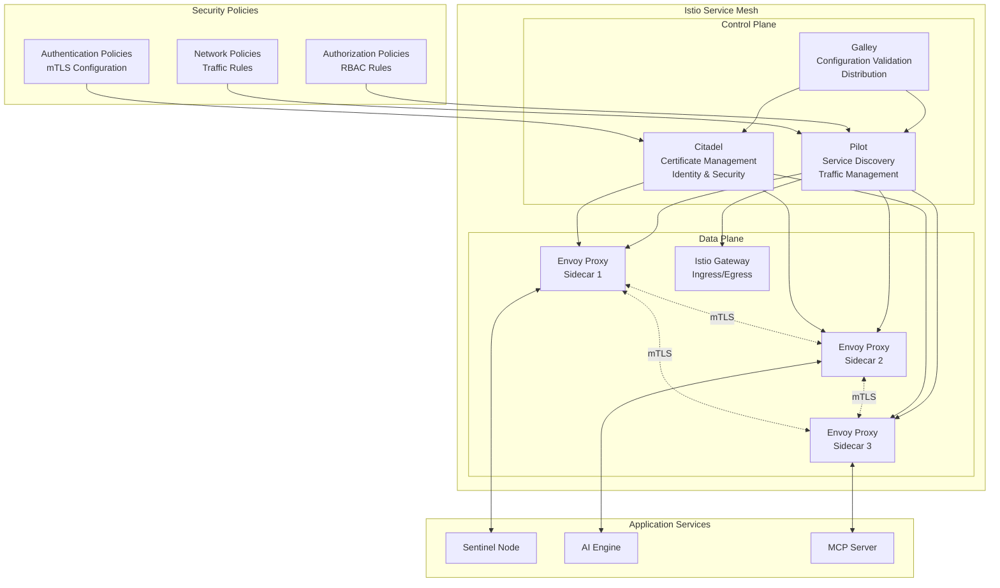

# DSN Architecture Documentation

## Overview

The Decentralized Sentinel Network (DSN) is built on a microservices architecture with five core components that work together to provide comprehensive security for MCP servers during audit operations.

## Core Principles

### Zero-Trust Architecture
- **Never Trust, Always Verify**: Every request is authenticated and authorized
- **Least Privilege Access**: Components have minimal required permissions
- **Continuous Verification**: Ongoing validation of all interactions

### Defense in Depth
- **Multiple Security Layers**: Redundant security controls
- **Fail-Safe Defaults**: Secure configuration by default
- **Compartmentalization**: Isolated components with limited blast radius

## System Architecture



## Component Details

### 1. Sentinel Nodes

**Purpose**: First line of defense - monitoring and threat detection

**Architecture**:


**Key Features**:
- **Health Monitoring**: CPU, memory, network, disk usage
- **Configuration Validation**: Real-time config drift detection
- **Threat Detection**: Behavioral analysis and anomaly detection
- **Lightweight Design**: Minimal resource footprint
- **Event-Driven**: Activates only during audit windows

**Implementation Details**:
- **Language**: Go for performance and concurrency
- **Communication**: gRPC for efficient inter-service communication
- **Deployment**: Kubernetes DaemonSet or AWS Lambda
- **Metrics**: Prometheus metrics exposition
- **Logging**: Structured logging with correlation IDs

### 2. Consensus Layer

**Purpose**: Distributed trust and state validation

**Architecture**:


**Key Features**:
- **Byzantine Fault Tolerance**: Handles up to 1/3 malicious nodes
- **Immutable Ledger**: Tamper-proof audit trail
- **Smart Contracts**: Automated validation logic
- **Gossip Protocol**: Efficient threat intelligence sharing
- **Identity Management**: Certificate-based authentication

**Data Structures**:
```json
{
  "block": {
    "header": {
      "number": 12345,
      "previous_hash": "0x...",
      "data_hash": "0x...",
      "timestamp": "2025-01-01T00:00:00Z"
    },
    "data": {
      "transactions": [
        {
          "type": "threat_detection",
          "sentinel_id": "sentinel-001",
          "threat_signature": "0x...",
          "severity": "high",
          "timestamp": "2025-01-01T00:00:00Z"
        }
      ]
    }
  }
}
```

### 3. AI-Driven Threat Anticipation

**Purpose**: Predictive security analysis and attack simulation

**Architecture**:


**ML Model Pipeline**:
1. **Data Collection**: Logs, metrics, threat feeds
2. **Feature Engineering**: Time-series analysis, statistical features
3. **Model Training**: Supervised and unsupervised learning
4. **Model Validation**: Cross-validation, A/B testing
5. **Deployment**: TensorFlow Lite for edge inference
6. **Monitoring**: Model drift detection, performance metrics

**Key Algorithms**:
- **Anomaly Detection**: Isolation Forest, One-Class SVM
- **Attack Prediction**: LSTM, GRU networks
- **Threat Classification**: Random Forest, XGBoost
- **Reinforcement Learning**: Q-learning for attack simulation

### 4. Self-Healing Mechanisms

**Purpose**: Automated threat response and system recovery

**Architecture**:


**Response Strategies**:
1. **Immediate Isolation**: Container quarantine, network segmentation
2. **Credential Rotation**: Automated key/certificate renewal
3. **State Recovery**: Rollback to known good state
4. **Resource Scaling**: Dynamic resource allocation
5. **Traffic Rerouting**: Load balancer reconfiguration

### 5. Communication Mesh

**Purpose**: Zero-trust networking and secure communication

**Architecture**:


**Security Features**:
- **Mutual TLS**: Automatic certificate provisioning and rotation
- **Zero Trust**: Default deny, explicit allow policies
- **Traffic Encryption**: End-to-end encryption for all communication
- **Access Control**: Fine-grained authorization policies
- **Observability**: Comprehensive metrics and tracing

## Security Controls

### Authentication & Authorization
- **OAuth 2.0**: External user authentication
- **mTLS**: Service-to-service authentication
- **RBAC**: Role-based access control
- **JWT**: Stateless token validation

### Data Protection
- **Encryption at Rest**: AES-256 for stored data
- **Encryption in Transit**: TLS 1.3 for all communication
- **Key Management**: HashiCorp Vault integration
- **Data Classification**: Sensitive data identification

### Network Security
- **Network Segmentation**: Kubernetes network policies
- **Traffic Filtering**: Istio security policies
- **DDoS Protection**: Rate limiting and circuit breakers
- **Intrusion Detection**: Real-time traffic analysis

### Compliance & Auditing
- **Audit Logging**: Comprehensive activity logs
- **Compliance Reporting**: Automated compliance checks
- **Incident Response**: Automated response procedures
- **Forensic Analysis**: Immutable audit trail

## Scalability & Performance

### Horizontal Scaling
- **Microservices**: Independent scaling of components
- **Container Orchestration**: Kubernetes auto-scaling
- **Load Balancing**: Intelligent traffic distribution
- **Database Sharding**: Distributed data storage

### Performance Optimization
- **Caching**: Redis for frequently accessed data
- **Connection Pooling**: Efficient resource utilization
- **Asynchronous Processing**: Non-blocking operations
- **Resource Limits**: Controlled resource consumption

## Disaster Recovery

### Backup Strategy
- **Automated Backups**: Regular data snapshots
- **Cross-Region Replication**: Geographic redundancy
- **Point-in-Time Recovery**: Granular recovery options
- **Backup Validation**: Regular restore testing

### High Availability
- **Multi-Zone Deployment**: Fault tolerance
- **Health Checks**: Proactive failure detection
- **Failover Automation**: Seamless service continuity
- **Circuit Breakers**: Graceful degradation

This architecture provides a robust, scalable, and secure foundation for the DSN system while maintaining the flexibility needed for a development/testing environment that can scale to production.