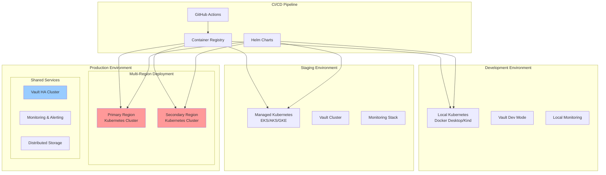

# DSN Deployment Guide

## Overview

This guide provides comprehensive instructions for deploying the Decentralized Sentinel Network (DSN) across different environments, from development to production. The deployment strategy emphasizes security, scalability, and operational excellence.

## Deployment Architecture



## Prerequisites

### Infrastructure Requirements

#### Minimum System Requirements
| Component | CPU | Memory | Storage | Network |
|-----------|-----|--------|---------|---------|
| **Sentinel Node** | 0.5 cores | 512MB | 10GB | 1Gbps |
| **Consensus Layer** | 2 cores | 4GB | 100GB SSD | 1Gbps |
| **AI Engine** | 4 cores | 8GB | 50GB SSD | 1Gbps |
| **Self-Healing** | 1 core | 2GB | 20GB | 1Gbps |
| **Communication Mesh** | 1 core | 1GB | 10GB | 1Gbps |

#### Production Requirements
| Environment | Nodes | Total CPU | Total Memory | Storage |
|-------------|-------|-----------|--------------|---------|
| **Development** | 3 | 8 cores | 16GB | 200GB |
| **Staging** | 6 | 24 cores | 64GB | 1TB |
| **Production** | 12+ | 48+ cores | 128+ GB | 5TB+ |

### Software Dependencies

#### Required Tools
```bash
# Container and Orchestration
docker >= 20.10
kubectl >= 1.25
helm >= 3.10

# Security Tools
vault >= 1.12
istioctl >= 1.16

# Development Tools
go >= 1.21
python >= 3.9
terraform >= 1.3

# Monitoring
prometheus >= 2.40
grafana >= 9.0
```

#### Installation Script
```bash
#!/bin/bash
# install-dependencies.sh

set -euo pipefail

echo "Installing DSN deployment dependencies..."

# Install Docker
curl -fsSL https://get.docker.com -o get-docker.sh
sh get-docker.sh

# Install kubectl
curl -LO "https://dl.k8s.io/release/$(curl -L -s https://dl.k8s.io/release/stable.txt)/bin/linux/amd64/kubectl"
sudo install -o root -g root -m 0755 kubectl /usr/local/bin/kubectl

# Install Helm
curl https://raw.githubusercontent.com/helm/helm/main/scripts/get-helm-3 | bash

# Install Vault CLI
wget -O- https://apt.releases.hashicorp.com/gpg | gpg --dearmor | sudo tee /usr/share/keyrings/hashicorp-archive-keyring.gpg
echo "deb [signed-by=/usr/share/keyrings/hashicorp-archive-keyring.gpg] https://apt.releases.hashicorp.com $(lsb_release -cs) main" | sudo tee /etc/apt/sources.list.d/hashicorp.list
sudo apt update && sudo apt install vault

# Install Istio
curl -L https://istio.io/downloadIstio | sh -
sudo mv istio-*/bin/istioctl /usr/local/bin/

echo "Dependencies installed successfully!"
```

## Environment Setup

### Development Environment

#### 1. Local Kubernetes Setup
```bash
# Using Kind (Kubernetes in Docker)
cat <<EOF | kind create cluster --config=-
kind: Cluster
apiVersion: kind.x-k8s.io/v1alpha4
name: dsn-dev
nodes:
- role: control-plane
  kubeadmConfigPatches:
  - |
    kind: InitConfiguration
    nodeRegistration:
      kubeletExtraArgs:
        node-labels: "ingress-ready=true"
  extraPortMappings:
  - containerPort: 80
    hostPort: 80
    protocol: TCP
  - containerPort: 443
    hostPort: 443
    protocol: TCP
- role: worker
- role: worker
EOF
```

#### 2. Development Configuration
```yaml
# dev-values.yaml
global:
  environment: development
  imageTag: latest
  imagePullPolicy: Always
  
security:
  mtls:
    enabled: false  # Simplified for development
  vault:
    dev_mode: true
    
monitoring:
  prometheus:
    retention: "7d"
  grafana:
    persistence: false
    
resources:
  limits:
    cpu: "500m"
    memory: "512Mi"
  requests:
    cpu: "100m"
    memory: "128Mi"
```

#### 3. Development Deployment
```bash
# Deploy development environment
make deploy-dev

# Or manually:
helm install dsn-dev ./deployments/helm/dsn \
  --namespace dsn-system \
  --create-namespace \
  --values deployments/helm/dsn/values-dev.yaml
```

### Staging Environment

#### 1. Cloud Kubernetes Setup
```bash
# AWS EKS
eksctl create cluster \
  --name dsn-staging \
  --region us-west-2 \
  --nodegroup-name standard-workers \
  --node-type m5.large \
  --nodes 3 \
  --nodes-min 1 \
  --nodes-max 4 \
  --managed

# Azure AKS
az aks create \
  --resource-group dsn-staging \
  --name dsn-staging \
  --node-count 3 \
  --node-vm-size Standard_D2s_v3 \
  --enable-addons monitoring \
  --generate-ssh-keys

# Google GKE
gcloud container clusters create dsn-staging \
  --zone us-central1-a \
  --num-nodes 3 \
  --machine-type n1-standard-2 \
  --enable-network-policy
```

#### 2. Staging Configuration
```yaml
# staging-values.yaml
global:
  environment: staging
  imageTag: "v1.0.0-rc1"
  imagePullPolicy: IfNotPresent
  
security:
  mtls:
    enabled: true
  vault:
    ha_mode: true
    replicas: 3
    
monitoring:
  prometheus:
    retention: "30d"
    storage: "100Gi"
  grafana:
    persistence: true
    storage: "10Gi"
    
resources:
  limits:
    cpu: "2000m"
    memory: "4Gi"
  requests:
    cpu: "500m"
    memory: "1Gi"
```

### Production Environment

#### 1. Multi-Region Setup
```yaml
# terraform/production/main.tf
module "primary_region" {
  source = "./modules/kubernetes-cluster"
  
  region = "us-west-2"
  cluster_name = "dsn-prod-primary"
  node_groups = {
    system = {
      instance_types = ["m5.large"]
      min_size = 3
      max_size = 10
      desired_size = 6
    }
    compute = {
      instance_types = ["c5.2xlarge"]
      min_size = 2
      max_size = 20
      desired_size = 4
    }
  }
}

module "secondary_region" {
  source = "./modules/kubernetes-cluster"
  
  region = "us-east-1"
  cluster_name = "dsn-prod-secondary"
  node_groups = {
    system = {
      instance_types = ["m5.large"]
      min_size = 3
      max_size = 10
      desired_size = 6
    }
    compute = {
      instance_types = ["c5.2xlarge"]
      min_size = 2
      max_size = 20
      desired_size = 4
    }
  }
}
```

#### 2. Production Configuration
```yaml
# production-values.yaml
global:
  environment: production
  imageTag: "v1.0.0"
  imagePullPolicy: IfNotPresent
  
security:
  mtls:
    enabled: true
  vault:
    ha_mode: true
    replicas: 5
    auto_unseal: true
    
monitoring:
  prometheus:
    retention: "90d"
    storage: "500Gi"
    ha_replicas: 2
  grafana:
    persistence: true
    storage: "50Gi"
    ha_replicas: 2
    
resources:
  limits:
    cpu: "4000m"
    memory: "8Gi"
  requests:
    cpu: "1000m"
    memory: "2Gi"
    
autoscaling:
  enabled: true
  minReplicas: 3
  maxReplicas: 20
  targetCPUUtilizationPercentage: 70
```

## Deployment Components

### 1. Helm Charts Structure

```
deployments/helm/dsn/
├── Chart.yaml
├── values.yaml
├── values-dev.yaml
├── values-staging.yaml
├── values-production.yaml
├── templates/
│   ├── _helpers.tpl
│   ├── configmap.yaml
│   ├── secret.yaml
│   ├── serviceaccount.yaml
│   ├── rbac.yaml
│   ├── sentinel/
│   │   ├── deployment.yaml
│   │   ├── service.yaml
│   │   └── hpa.yaml
│   ├── consensus/
│   │   ├── statefulset.yaml
│   │   ├── service.yaml
│   │   └── pvc.yaml
│   ├── ai-engine/
│   │   ├── deployment.yaml
│   │   ├── service.yaml
│   │   └── configmap.yaml
│   ├── self-healing/
│   │   ├── deployment.yaml
│   │   └── rbac.yaml
│   └── istio/
│       ├── gateway.yaml
│       ├── virtualservice.yaml
│       └── peerauthentication.yaml
└── crds/
    └── dsn-crds.yaml
```

#### Main Chart Configuration
```yaml
# Chart.yaml
apiVersion: v2
name: dsn
description: Decentralized Sentinel Network Helm Chart
type: application
version: 1.0.0
appVersion: "1.0.0"

dependencies:
- name: prometheus
  version: "15.x.x"
  repository: "https://prometheus-community.github.io/helm-charts"
  condition: monitoring.prometheus.enabled

- name: grafana
  version: "6.x.x"
  repository: "https://grafana.github.io/helm-charts"
  condition: monitoring.grafana.enabled

- name: vault
  version: "0.22.x"
  repository: "https://helm.releases.hashicorp.com"
  condition: security.vault.enabled
```

### 2. Kubernetes Manifests

#### Sentinel Node Deployment
```yaml
# templates/sentinel/deployment.yaml
apiVersion: apps/v1
kind: Deployment
metadata:
  name: {{ include "dsn.fullname" . }}-sentinel
  labels:
    {{- include "dsn.labels" . | nindent 4 }}
    app.kubernetes.io/component: sentinel
spec:
  replicas: {{ .Values.sentinel.replicas }}
  selector:
    matchLabels:
      {{- include "dsn.selectorLabels" . | nindent 6 }}
      app.kubernetes.io/component: sentinel
  template:
    metadata:
      labels:
        {{- include "dsn.selectorLabels" . | nindent 8 }}
        app.kubernetes.io/component: sentinel
      annotations:
        prometheus.io/scrape: "true"
        prometheus.io/port: "8080"
        prometheus.io/path: "/metrics"
    spec:
      serviceAccountName: {{ include "dsn.serviceAccountName" . }}-sentinel
      securityContext:
        {{- toYaml .Values.podSecurityContext | nindent 8 }}
      containers:
      - name: sentinel
        image: "{{ .Values.image.repository }}/sentinel:{{ .Values.image.tag }}"
        imagePullPolicy: {{ .Values.image.pullPolicy }}
        ports:
        - name: grpc
          containerPort: 9090
          protocol: TCP
        - name: metrics
          containerPort: 8080
          protocol: TCP
        env:
        - name: DSN_ENVIRONMENT
          value: {{ .Values.global.environment }}
        - name: DSN_LOG_LEVEL
          value: {{ .Values.logging.level }}
        - name: VAULT_ADDR
          value: {{ .Values.security.vault.address }}
        livenessProbe:
          grpc:
            port: 9090
          initialDelaySeconds: 30
          periodSeconds: 10
        readinessProbe:
          grpc:
            port: 9090
          initialDelaySeconds: 5
          periodSeconds: 5
        resources:
          {{- toYaml .Values.sentinel.resources | nindent 12 }}
        securityContext:
          {{- toYaml .Values.securityContext | nindent 12 }}
        volumeMounts:
        - name: config
          mountPath: /etc/dsn
          readOnly: true
        - name: tls-certs
          mountPath: /etc/tls
          readOnly: true
      volumes:
      - name: config
        configMap:
          name: {{ include "dsn.fullname" . }}-config
      - name: tls-certs
        secret:
          secretName: {{ include "dsn.fullname" . }}-tls
```

#### Consensus Layer StatefulSet
```yaml
# templates/consensus/statefulset.yaml
apiVersion: apps/v1
kind: StatefulSet
metadata:
  name: {{ include "dsn.fullname" . }}-consensus
  labels:
    {{- include "dsn.labels" . | nindent 4 }}
    app.kubernetes.io/component: consensus
spec:
  serviceName: {{ include "dsn.fullname" . }}-consensus-headless
  replicas: {{ .Values.consensus.replicas }}
  selector:
    matchLabels:
      {{- include "dsn.selectorLabels" . | nindent 6 }}
      app.kubernetes.io/component: consensus
  template:
    metadata:
      labels:
        {{- include "dsn.selectorLabels" . | nindent 8 }}
        app.kubernetes.io/component: consensus
    spec:
      serviceAccountName: {{ include "dsn.serviceAccountName" . }}-consensus
      containers:
      - name: peer
        image: "{{ .Values.image.repository }}/consensus:{{ .Values.image.tag }}"
        imagePullPolicy: {{ .Values.image.pullPolicy }}
        ports:
        - name: peer
          containerPort: 7051
        - name: chaincode
          containerPort: 7052
        - name: operations
          containerPort: 9443
        env:
        - name: CORE_PEER_ID
          valueFrom:
            fieldRef:
              fieldPath: metadata.name
        - name: CORE_PEER_ADDRESS
          value: "$(CORE_PEER_ID).{{ include "dsn.fullname" . }}-consensus-headless:7051"
        - name: CORE_PEER_LOCALMSPID
          value: {{ .Values.consensus.mspId }}
        volumeMounts:
        - name: peer-storage
          mountPath: /var/hyperledger/production
        - name: msp
          mountPath: /etc/hyperledger/fabric/msp
          readOnly: true
        - name: tls
          mountPath: /etc/hyperledger/fabric/tls
          readOnly: true
        resources:
          {{- toYaml .Values.consensus.resources | nindent 12 }}
      volumes:
      - name: msp
        secret:
          secretName: {{ include "dsn.fullname" . }}-consensus-msp
      - name: tls
        secret:
          secretName: {{ include "dsn.fullname" . }}-consensus-tls
  volumeClaimTemplates:
  - metadata:
      name: peer-storage
    spec:
      accessModes: ["ReadWriteOnce"]
      storageClassName: {{ .Values.consensus.storageClass }}
      resources:
        requests:
          storage: {{ .Values.consensus.storage }}
```

### 3. Istio Service Mesh Configuration

#### Gateway Configuration
```yaml
# templates/istio/gateway.yaml
apiVersion: networking.istio.io/v1beta1
kind: Gateway
metadata:
  name: {{ include "dsn.fullname" . }}-gateway
  labels:
    {{- include "dsn.labels" . | nindent 4 }}
spec:
  selector:
    istio: ingressgateway
  servers:
  - port:
      number: 443
      name: https
      protocol: HTTPS
    tls:
      mode: SIMPLE
      credentialName: {{ include "dsn.fullname" . }}-tls-cert
    hosts:
    - {{ .Values.ingress.host }}
  - port:
      number: 80
      name: http
      protocol: HTTP
    hosts:
    - {{ .Values.ingress.host }}
    redirect:
      httpsRedirect: true
```

#### Virtual Service Configuration
```yaml
# templates/istio/virtualservice.yaml
apiVersion: networking.istio.io/v1beta1
kind: VirtualService
metadata:
  name: {{ include "dsn.fullname" . }}-vs
  labels:
    {{- include "dsn.labels" . | nindent 4 }}
spec:
  hosts:
  - {{ .Values.ingress.host }}
  gateways:
  - {{ include "dsn.fullname" . }}-gateway
  http:
  - match:
    - uri:
        prefix: /api/v1/sentinel
    route:
    - destination:
        host: {{ include "dsn.fullname" . }}-sentinel
        port:
          number: 9090
    timeout: 30s
    retries:
      attempts: 3
      perTryTimeout: 10s
  - match:
    - uri:
        prefix: /api/v1/consensus
    route:
    - destination:
        host: {{ include "dsn.fullname" . }}-consensus
        port:
          number: 7051
    timeout: 60s
```

## CI/CD Pipeline

### GitHub Actions Workflow

```yaml
# .github/workflows/deploy.yml
name: Deploy DSN

on:
  push:
    branches: [main, develop]
    tags: ['v*']
  pull_request:
    branches: [main]

env:
  REGISTRY: ghcr.io
  IMAGE_NAME: ${{ github.repository }}

jobs:
  test:
    runs-on: ubuntu-latest
    steps:
    - uses: actions/checkout@v3
    
    - name: Set up Go
      uses: actions/setup-go@v3
      with:
        go-version: 1.21
    
    - name: Run tests
      run: make test
    
    - name: Run security scan
      run: make security-scan

  build:
    needs: test
    runs-on: ubuntu-latest
    outputs:
      image-tag: ${{ steps.meta.outputs.tags }}
      image-digest: ${{ steps.build.outputs.digest }}
    steps:
    - uses: actions/checkout@v3
    
    - name: Set up Docker Buildx
      uses: docker/setup-buildx-action@v2
    
    - name: Log in to Container Registry
      uses: docker/login-action@v2
      with:
        registry: ${{ env.REGISTRY }}
        username: ${{ github.actor }}
        password: ${{ secrets.GITHUB_TOKEN }}
    
    - name: Extract metadata
      id: meta
      uses: docker/metadata-action@v4
      with:
        images: ${{ env.REGISTRY }}/${{ env.IMAGE_NAME }}
        tags: |
          type=ref,event=branch
          type=ref,event=pr
          type=semver,pattern={{version}}
          type=semver,pattern={{major}}.{{minor}}
    
    - name: Build and push Docker images
      id: build
      uses: docker/build-push-action@v4
      with:
        context: .
        platforms: linux/amd64,linux/arm64
        push: true
        tags: ${{ steps.meta.outputs.tags }}
        labels: ${{ steps.meta.outputs.labels }}
        cache-from: type=gha
        cache-to: type=gha,mode=max

  deploy-dev:
    if: github.ref == 'refs/heads/develop'
    needs: build
    runs-on: ubuntu-latest
    environment: development
    steps:
    - uses: actions/checkout@v3
    
    - name: Configure kubectl
      uses: azure/k8s-set-context@v1
      with:
        method: kubeconfig
        kubeconfig: ${{ secrets.KUBE_CONFIG_DEV }}
    
    - name: Deploy to development
      run: |
        helm upgrade --install dsn-dev ./deployments/helm/dsn \
          --namespace dsn-system \
          --create-namespace \
          --values deployments/helm/dsn/values-dev.yaml \
          --set image.tag=${{ needs.build.outputs.image-tag }}

  deploy-staging:
    if: github.ref == 'refs/heads/main'
    needs: build
    runs-on: ubuntu-latest
    environment: staging
    steps:
    - uses: actions/checkout@v3
    
    - name: Configure kubectl
      uses: azure/k8s-set-context@v1
      with:
        method: kubeconfig
        kubeconfig: ${{ secrets.KUBE_CONFIG_STAGING }}
    
    - name: Deploy to staging
      run: |
        helm upgrade --install dsn-staging ./deployments/helm/dsn \
          --namespace dsn-system \
          --create-namespace \
          --values deployments/helm/dsn/values-staging.yaml \
          --set image.tag=${{ needs.build.outputs.image-tag }}

  deploy-production:
    if: startsWith(github.ref, 'refs/tags/v')
    needs: build
    runs-on: ubuntu-latest
    environment: production
    steps:
    - uses: actions/checkout@v3
    
    - name: Configure kubectl (Primary)
      uses: azure/k8s-set-context@v1
      with:
        method: kubeconfig
        kubeconfig: ${{ secrets.KUBE_CONFIG_PROD_PRIMARY }}
    
    - name: Deploy to production (Primary)
      run: |
        helm upgrade --install dsn-prod ./deployments/helm/dsn \
          --namespace dsn-system \
          --create-namespace \
          --values deployments/helm/dsn/values-production.yaml \
          --set image.tag=${{ needs.build.outputs.image-tag }}
    
    - name: Configure kubectl (Secondary)
      uses: azure/k8s-set-context@v1
      with:
        method: kubeconfig
        kubeconfig: ${{ secrets.KUBE_CONFIG_PROD_SECONDARY }}
    
    - name: Deploy to production (Secondary)
      run: |
        helm upgrade --install dsn-prod ./deployments/helm/dsn \
          --namespace dsn-system \
          --create-namespace \
          --values deployments/helm/dsn/values-production.yaml \
          --set image.tag=${{ needs.build.outputs.image-tag }}
```

## Monitoring & Observability

### Prometheus Configuration
```yaml
# monitoring/prometheus-config.yaml
global:
  scrape_interval: 15s
  evaluation_interval: 15s

rule_files:
  - "dsn-rules.yml"

scrape_configs:
- job_name: 'dsn-sentinel'
  kubernetes_sd_configs:
  - role: pod
    namespaces:
      names:
      - dsn-system
  relabel_configs:
  - source_labels: [__meta_kubernetes_pod_label_app_kubernetes_io_component]
    action: keep
    regex: sentinel
  - source_labels: [__meta_kubernetes_pod_annotation_prometheus_io_scrape]
    action: keep
    regex: true

- job_name: 'dsn-consensus'
  kubernetes_sd_configs:
  - role: pod
    namespaces:
      names:
      - dsn-system
  relabel_configs:
  - source_labels: [__meta_kubernetes_pod_label_app_kubernetes_io_component]
    action: keep
    regex: consensus
```

### Grafana Dashboards
```json
{
  "dashboard": {
    "title": "DSN Security Overview",
    "panels": [
      {
        "title": "Threat Detection Rate",
        "type": "stat",
        "targets": [
          {
            "expr": "rate(dsn_threats_detected_total[5m])",
            "legendFormat": "Threats/sec"
          }
        ]
      },
      {
        "title": "System Health",
        "type": "graph",
        "targets": [
          {
            "expr": "dsn_component_health_status",
            "legendFormat": "{{ component }}"
          }
        ]
      }
    ]
  }
}
```

## Backup & Disaster Recovery

### Backup Strategy
```yaml
# backup/backup-config.yaml
apiVersion: v1
kind: ConfigMap
metadata:
  name: backup-config
data:
  backup-script.sh: |
    #!/bin/bash
    
    # Backup consensus layer data
    kubectl exec -n dsn-system sts/dsn-consensus-0 -- \
      tar czf - /var/hyperledger/production | \
      aws s3 cp - s3://dsn-backups/consensus/$(date +%Y%m%d-%H%M%S).tar.gz
    
    # Backup Vault data
    vault operator raft snapshot save \
      s3://dsn-backups/vault/$(date +%Y%m%d-%H%M%S).snap
    
    # Backup monitoring data
    kubectl exec -n dsn-system deploy/prometheus-server -- \
      tar czf - /prometheus | \
      aws s3 cp - s3://dsn-backups/prometheus/$(date +%Y%m%d-%H%M%S).tar.gz
```

### Disaster Recovery Procedures
```bash
#!/bin/bash
# disaster-recovery.sh

set -euo pipefail

BACKUP_DATE=${1:-$(date +%Y%m%d)}
REGION=${2:-us-west-2}

echo "Starting disaster recovery for date: $BACKUP_DATE"

# 1. Restore infrastructure
terraform apply -var="region=$REGION" -auto-approve

# 2. Restore Vault
vault operator raft snapshot restore \
  s3://dsn-backups/vault/$BACKUP_DATE-*.snap

# 3. Restore consensus layer
aws s3 cp s3://dsn-backups/consensus/$BACKUP_DATE-*.tar.gz - | \
  kubectl exec -i -n dsn-system sts/dsn-consensus-0 -- \
  tar xzf - -C /var/hyperledger/production

# 4. Restart services
kubectl rollout restart -n dsn-system deployment/dsn-sentinel
kubectl rollout restart -n dsn-system statefulset/dsn-consensus

echo "Disaster recovery completed successfully"
```

## Troubleshooting

### Common Issues

#### 1. Pod Startup Issues
```bash
# Check pod status
kubectl get pods -n dsn-system

# Check pod logs
kubectl logs -n dsn-system deployment/dsn-sentinel

# Check events
kubectl get events -n dsn-system --sort-by='.lastTimestamp'

# Debug pod
kubectl describe pod -n dsn-system <pod-name>
```

#### 2. Network Connectivity Issues
```bash
# Test service connectivity
kubectl exec -n dsn-system deployment/dsn-sentinel -- \
  nc -zv dsn-consensus 7051

# Check Istio configuration
istioctl proxy-config cluster dsn-sentinel-<pod-id> -n dsn-system

# Verify mTLS
istioctl authn tls-check dsn-sentinel-<pod-id>.dsn-system
```

#### 3. Certificate Issues
```bash
# Check certificate expiration
kubectl get secret -n dsn-system dsn-tls -o jsonpath='{.data.tls\.crt}' | \
  base64 -d | openssl x509 -noout -dates

# Rotate certificates
kubectl delete secret -n dsn-system dsn-tls
helm upgrade dsn ./deployments/helm/dsn --reuse-values
```

### Performance Tuning

#### Resource Optimization
```yaml
# performance-tuning.yaml
resources:
  sentinel:
    requests:
      cpu: "100m"
      memory: "128Mi"
    limits:
      cpu: "500m"
      memory: "512Mi"
  
  consensus:
    requests:
      cpu: "500m"
      memory: "1Gi"
    limits:
      cpu: "2000m"
      memory: "4Gi"
  
  ai_engine:
    requests:
      cpu: "1000m"
      memory: "2Gi"
    limits:
      cpu: "4000m"
      memory: "8Gi"
```

This comprehensive deployment guide provides everything needed to successfully deploy and operate the DSN across different environments while maintaining security, scalability, and operational excellence.