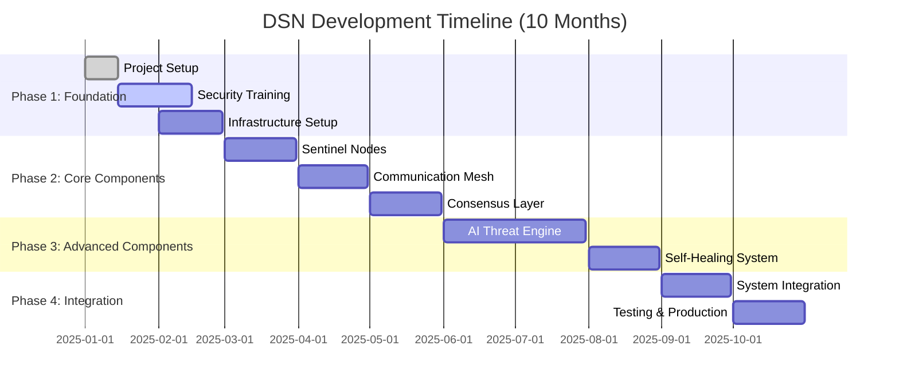

# DSN Development Roadmap

## Overview

This roadmap outlines the development phases for the Decentralized Sentinel Network (DSN), designed for a full-stack team new to security-focused architectures. The plan emphasizes learning, incremental development, and risk mitigation.

## Development Timeline



## Phase 1: Foundation & Learning (Months 1-2)

### Objectives
- Establish project foundation and team knowledge
- Set up development environment and tooling
- Build security architecture understanding
- Create initial infrastructure

### Month 1: Project Setup & Security Fundamentals

#### Week 1-2: Project Infrastructure
**Deliverables:**
- [ ] Project repository structure
- [ ] CI/CD pipeline setup (GitHub Actions)
- [ ] Development environment (Docker Compose)
- [ ] Code quality tools (linting, testing, security scanning)
- [ ] Documentation framework (GitBook/MkDocs)

**Key Activities:**
```bash
# Repository setup
mkdir -p {cmd,internal,pkg,deployments,scripts,test,tools,docs}
git init && git remote add origin <repo-url>

# CI/CD pipeline
# - GitHub Actions workflows
# - Security scanning (Snyk, CodeQL)
# - Automated testing
# - Docker image building

# Development environment
docker-compose up -d  # Local development stack
```

**Learning Focus:**
- Git workflow and branching strategy
- Container security best practices
- Infrastructure as Code principles

#### Week 3-4: Security Architecture Training
**Training Modules:**
1. **Zero-Trust Architecture**
   - Principles and implementation
   - Network segmentation strategies
   - Identity and access management

2. **Container Security**
   - Docker security best practices
   - Kubernetes security model
   - Runtime security monitoring

3. **Cryptography Fundamentals**
   - TLS/mTLS implementation
   - Certificate management
   - Key rotation strategies

4. **Threat Modeling**
   - STRIDE methodology
   - Attack surface analysis
   - Risk assessment techniques

**Practical Exercises:**
- Set up mTLS between two services
- Implement basic RBAC in Kubernetes
- Create threat model for MCP server

### Month 2: Infrastructure & Monitoring

#### Week 1-2: Core Infrastructure
**Deliverables:**
- [ ] Kubernetes cluster setup (local/cloud)
- [ ] HashiCorp Vault deployment
- [ ] Monitoring stack (Prometheus/Grafana)
- [ ] Logging infrastructure (ELK/Loki)
- [ ] Secret management integration

**Infrastructure Components:**
```yaml
# Kubernetes cluster
apiVersion: v1
kind: Namespace
metadata:
  name: dsn-system
---
# Vault deployment
apiVersion: apps/v1
kind: Deployment
metadata:
  name: vault
  namespace: dsn-system
spec:
  # Vault configuration
---
# Monitoring stack
apiVersion: v1
kind: ConfigMap
metadata:
  name: prometheus-config
  namespace: dsn-system
data:
  prometheus.yml: |
    # Prometheus configuration
```

#### Week 3-4: Security Tooling
**Deliverables:**
- [ ] Security scanning pipeline
- [ ] Vulnerability management
- [ ] Compliance checking tools
- [ ] Incident response procedures

**Security Tools Integration:**
- **SAST**: SonarQube, CodeQL
- **DAST**: OWASP ZAP, Burp Suite
- **Container Scanning**: Trivy, Clair
- **Infrastructure Scanning**: Checkov, Terrascan

## Phase 2: Core Components Development (Months 3-5)

### Month 3: Sentinel Nodes

#### Architecture Decision
**Why Start Here:**
- Simplest component with clear requirements
- Builds Go and gRPC expertise
- Foundation for monitoring patterns
- Low complexity, high learning value

#### Week 1: Design & Prototyping
**Deliverables:**
- [ ] Sentinel node architecture design
- [ ] API specification (gRPC/Protocol Buffers)
- [ ] Data models and schemas
- [ ] Basic prototype implementation

**Design Specifications:**
```protobuf
// sentinel.proto
syntax = "proto3";

package dsn.sentinel.v1;

service SentinelService {
  rpc RegisterSentinel(RegisterRequest) returns (RegisterResponse);
  rpc ReportHealth(HealthReport) returns (HealthResponse);
  rpc DetectThreats(ThreatDetectionRequest) returns (ThreatDetectionResponse);
  rpc ValidateConfig(ConfigValidationRequest) returns (ConfigValidationResponse);
}

message HealthReport {
  string sentinel_id = 1;
  int64 timestamp = 2;
  SystemMetrics system_metrics = 3;
  repeated SecurityEvent security_events = 4;
}
```

#### Week 2-3: Core Implementation
**Deliverables:**
- [ ] Health monitoring module
- [ ] Configuration validation engine
- [ ] Basic threat detection rules
- [ ] Prometheus metrics integration

**Implementation Structure:**
```go
// internal/sentinel/
├── agent/          # Main sentinel agent
├── monitor/        # Health monitoring
├── detector/       # Threat detection
├── validator/      # Configuration validation
├── metrics/        # Prometheus integration
└── grpc/          # gRPC server implementation
```

**Key Features:**
- System resource monitoring (CPU, memory, disk, network)
- Configuration drift detection
- Log analysis and pattern matching
- Event correlation and alerting

#### Week 4: Testing & Integration
**Deliverables:**
- [ ] Unit tests (>80% coverage)
- [ ] Integration tests with monitoring stack
- [ ] Performance benchmarks
- [ ] Documentation and runbooks

**Testing Strategy:**
```go
func TestSentinelAgent(t *testing.T) {
    // Test health monitoring
    // Test threat detection
    // Test configuration validation
    // Test metrics collection
}
```

### Month 4: Communication Mesh

#### Architecture Decision
**Why Second:**
- Critical security foundation
- Enables secure inter-component communication
- Istio provides mature, well-documented solution
- Essential for zero-trust architecture

#### Week 1: Istio Setup & Configuration
**Deliverables:**
- [ ] Istio installation and configuration
- [ ] Certificate authority setup
- [ ] Basic service mesh policies
- [ ] Traffic management rules

**Istio Configuration:**
```yaml
# istio-config.yaml
apiVersion: security.istio.io/v1beta1
kind: PeerAuthentication
metadata:
  name: default
  namespace: dsn-system
spec:
  mtls:
    mode: STRICT
---
apiVersion: security.istio.io/v1beta1
kind: AuthorizationPolicy
metadata:
  name: dsn-authz
  namespace: dsn-system
spec:
  rules:
  - from:
    - source:
        principals: ["cluster.local/ns/dsn-system/sa/sentinel-agent"]
    to:
    - operation:
        methods: ["GET", "POST"]
```

#### Week 2-3: Security Policies & mTLS
**Deliverables:**
- [ ] mTLS configuration for all services
- [ ] Authorization policies (RBAC)
- [ ] Network policies
- [ ] Traffic encryption validation

**Security Implementation:**
- Automatic certificate provisioning
- Service-to-service authentication
- Fine-grained access control
- Traffic observability and monitoring

#### Week 4: Integration & Testing
**Deliverables:**
- [ ] Sentinel node integration with service mesh
- [ ] End-to-end encryption testing
- [ ] Performance impact analysis
- [ ] Security policy validation

### Month 5: Consensus Layer

#### Architecture Decision
**Why Third:**
- Most complex component requiring solid foundation
- Builds on secure communication mesh
- Hyperledger Fabric provides enterprise-grade solution
- Critical for system trust and integrity

#### Week 1-2: Hyperledger Fabric Setup
**Deliverables:**
- [ ] Fabric network configuration
- [ ] Peer nodes deployment
- [ ] Ordering service setup
- [ ] Certificate authority configuration

**Network Configuration:**
```yaml
# fabric-network.yaml
Organizations:
  - &DSNOrg
    Name: DSNOrg
    ID: DSNOrgMSP
    MSPDir: crypto-config/peerOrganizations/dsn.example.com/msp
    Policies:
      Readers:
        Type: Signature
        Rule: "OR('DSNOrgMSP.member')"
      Writers:
        Type: Signature
        Rule: "OR('DSNOrgMSP.member')"
      Admins:
        Type: Signature
        Rule: "OR('DSNOrgMSP.admin')"
```

#### Week 3: Smart Contracts & Chaincode
**Deliverables:**
- [ ] Threat intelligence chaincode
- [ ] State validation smart contracts
- [ ] Consensus algorithms implementation
- [ ] Data persistence layer

**Chaincode Implementation:**
```go
// chaincode/threat-intelligence/
package main

import (
    "github.com/hyperledger/fabric-contract-api-go/contractapi"
)

type ThreatIntelligenceContract struct {
    contractapi.Contract
}

func (t *ThreatIntelligenceContract) RecordThreat(ctx contractapi.TransactionContextInterface, threatID string, signature string, severity string) error {
    // Validate threat data
    // Store in ledger
    // Update threat intelligence
    return nil
}
```

#### Week 4: Integration & Testing
**Deliverables:**
- [ ] Sentinel node integration with consensus layer
- [ ] Threat intelligence sharing
- [ ] State synchronization testing
- [ ] Performance benchmarking

## Phase 3: Advanced Components (Months 6-8)

### Months 6-7: AI-Driven Threat Anticipation

#### Architecture Decision
**Why Fourth:**
- Requires consensus layer for validation
- Most innovative and complex component
- Benefits from established monitoring data
- Can be developed incrementally

#### Month 6: Data Pipeline & Basic ML

##### Week 1-2: Data Infrastructure
**Deliverables:**
- [ ] Data collection pipeline
- [ ] Feature engineering framework
- [ ] Data storage and preprocessing
- [ ] ML training infrastructure

**Data Pipeline:**
```python
# internal/ai/pipeline/
├── collectors/     # Data collection modules
├── processors/     # Feature engineering
├── storage/        # Data persistence
└── training/       # ML model training
```

##### Week 3-4: Anomaly Detection
**Deliverables:**
- [ ] Isolation Forest implementation
- [ ] Statistical anomaly detection
- [ ] Real-time inference engine
- [ ] Model validation framework

**ML Implementation:**
```python
# anomaly_detector.py
import tensorflow as tf
from sklearn.ensemble import IsolationForest

class AnomalyDetector:
    def __init__(self):
        self.model = IsolationForest(contamination=0.1)
        
    def train(self, training_data):
        self.model.fit(training_data)
        
    def predict(self, data):
        return self.model.predict(data)
```

#### Month 7: Advanced ML & Prediction

##### Week 1-2: Attack Prediction Models
**Deliverables:**
- [ ] LSTM network for sequence prediction
- [ ] Time-series analysis models
- [ ] Attack pattern recognition
- [ ] Threat classification system

##### Week 3-4: Integration & Validation
**Deliverables:**
- [ ] Consensus layer integration
- [ ] Real-time inference deployment
- [ ] Model performance monitoring
- [ ] Prediction accuracy validation

### Month 8: Self-Healing Mechanisms

#### Architecture Decision
**Why Last:**
- Integrates with all other components
- Requires mature monitoring and consensus
- Most critical for system resilience
- Benefits from complete system context

#### Week 1-2: Response Engine
**Deliverables:**
- [ ] Threat response rule engine
- [ ] Automated remediation actions
- [ ] Kubernetes API integration
- [ ] Vault integration for credential rotation

**Response Engine:**
```go
// internal/healing/engine.go
type ResponseEngine struct {
    k8sClient    kubernetes.Interface
    vaultClient  *vault.Client
    ruleEngine   *rules.Engine
}

func (r *ResponseEngine) HandleThreat(threat *Threat) error {
    actions := r.ruleEngine.GetActions(threat)
    for _, action := range actions {
        switch action.Type {
        case "isolate":
            return r.isolateContainer(action.Target)
        case "rotate":
            return r.rotateCredentials(action.Target)
        case "rollback":
            return r.rollbackState(action.Target)
        }
    }
    return nil
}
```

#### Week 3-4: Recovery & Validation
**Deliverables:**
- [ ] State recovery mechanisms
- [ ] Health validation after remediation
- [ ] Incident reporting system
- [ ] Recovery verification testing

## Phase 4: Integration & Testing (Months 9-10)

### Month 9: System Integration

#### Week 1-2: End-to-End Integration
**Deliverables:**
- [ ] Complete system deployment
- [ ] Inter-component communication testing
- [ ] Data flow validation
- [ ] Performance optimization

#### Week 3-4: Security Testing
**Deliverables:**
- [ ] Penetration testing
- [ ] Vulnerability assessment
- [ ] Security policy validation
- [ ] Compliance checking

### Month 10: Production Readiness

#### Week 1-2: Performance & Scalability
**Deliverables:**
- [ ] Load testing and optimization
- [ ] Scalability validation
- [ ] Resource optimization
- [ ] Cost analysis

#### Week 3-4: Documentation & Training
**Deliverables:**
- [ ] Complete system documentation
- [ ] Operational runbooks
- [ ] Team training materials
- [ ] Deployment procedures

## Risk Mitigation Strategies

### Technical Risks

#### Complexity Management
**Risk**: System complexity overwhelming team
**Mitigation**:
- Modular development approach
- Clear component interfaces
- Comprehensive documentation
- Regular architecture reviews

#### Performance Requirements
**Risk**: System not meeting performance targets
**Mitigation**:
- Early performance testing
- Continuous benchmarking
- Resource optimization focus
- Scalability planning

#### Security Vulnerabilities
**Risk**: Security flaws in implementation
**Mitigation**:
- Security-first development
- Regular security reviews
- Automated security testing
- External security audits

### Team Risks

#### Knowledge Gaps
**Risk**: Team lacking security architecture expertise
**Mitigation**:
- Structured learning program
- External security consultants
- Pair programming with experts
- Regular knowledge sharing sessions

#### Resource Constraints
**Risk**: Insufficient development resources
**Mitigation**:
- Prioritized feature development
- MVP approach for each component
- Automated testing and deployment
- Clear scope management

## Success Metrics

### Development Metrics
- **Code Quality**: >80% test coverage, <5% technical debt
- **Security**: Zero critical vulnerabilities, 100% security scan pass rate
- **Performance**: <100ms response time, >99.9% uptime
- **Documentation**: 100% API documentation, complete runbooks

### Learning Metrics
- **Team Knowledge**: Security architecture certification completion
- **Best Practices**: Adoption of security coding standards
- **Process Maturity**: Automated security testing integration

### Business Metrics
- **Time to Market**: On-time delivery of each phase
- **Cost Efficiency**: Within budget constraints
- **Risk Reduction**: Measurable improvement in security posture

This roadmap provides a structured approach to building the DSN while ensuring the team develops the necessary security expertise and the system meets its ambitious goals.