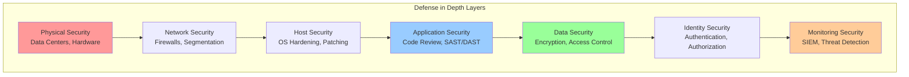
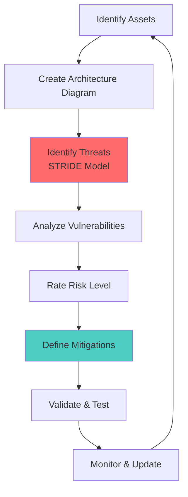
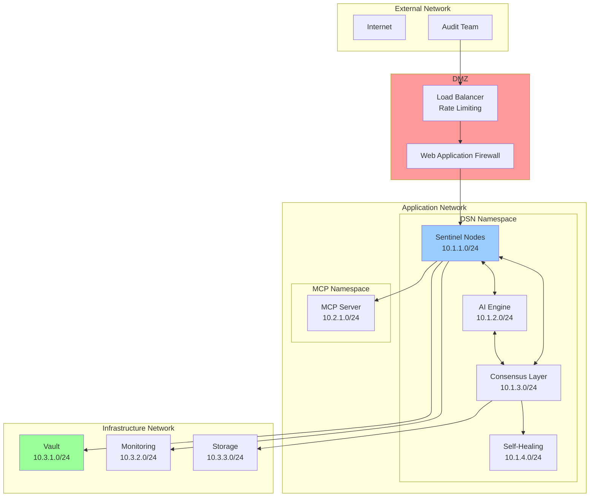
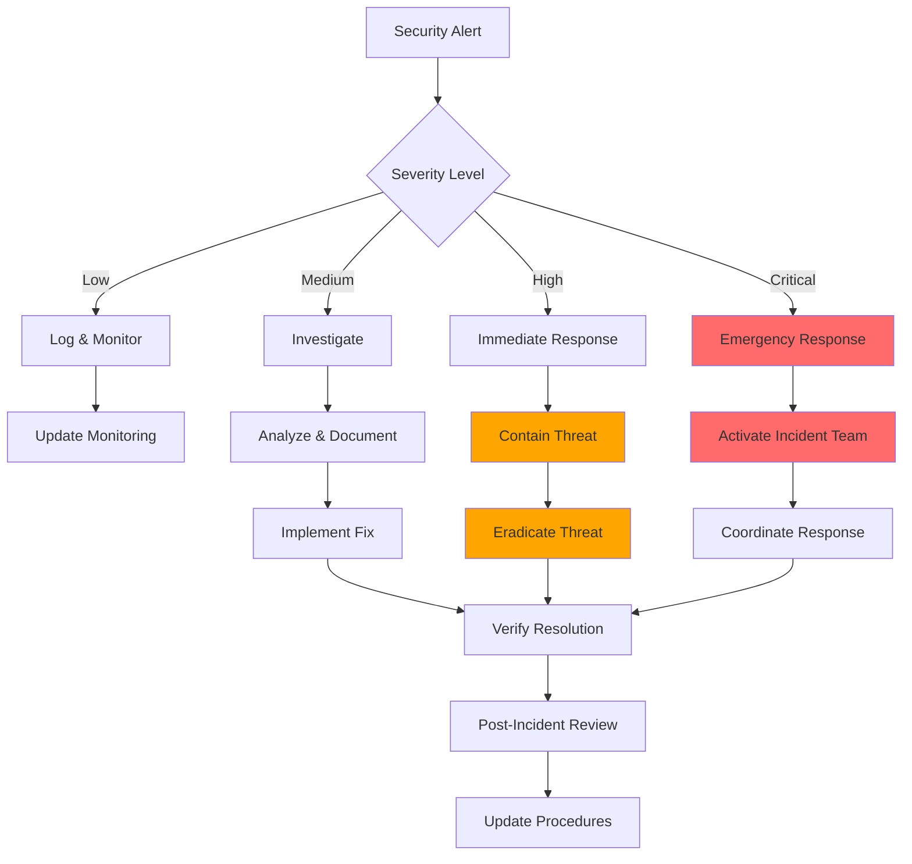

# DSN Security Guidelines

## Overview

This document outlines the security guidelines, best practices, and requirements for developing and deploying the Decentralized Sentinel Network (DSN). These guidelines are designed for full-stack teams new to security-focused architectures.

## Security Principles

### 1. Zero Trust Architecture
**Never Trust, Always Verify**
- Assume breach mentality
- Verify every request and user
- Continuous authentication and authorization
- Minimal trust boundaries

**Implementation:**
```yaml
# Example: Zero Trust Network Policy
apiVersion: networking.k8s.io/v1
kind: NetworkPolicy
metadata:
  name: deny-all-default
  namespace: dsn-system
spec:
  podSelector: {}
  policyTypes:
  - Ingress
  - Egress
  # Default deny all traffic
```

### 2. Defense in Depth
**Multiple Security Layers**
- Redundant security controls
- Fail-safe defaults
- Compartmentalization
- Graceful degradation

**Security Layers:**


### 3. Principle of Least Privilege
**Minimal Access Rights**
- Grant minimum necessary permissions
- Regular access reviews
- Just-in-time access
- Privilege escalation controls

### 4. Secure by Default
**Security Built-in, Not Bolted-on**
- Secure default configurations
- Automatic security updates
- Fail-secure mechanisms
- Security-first design decisions

## Secure Development Lifecycle (SDLC)

### 1. Planning & Requirements
**Security Requirements:**
- [ ] Threat modeling completed
- [ ] Security requirements documented
- [ ] Compliance requirements identified
- [ ] Risk assessment performed

**Threat Modeling Process:**


**STRIDE Threat Categories:**
- **Spoofing**: Identity verification
- **Tampering**: Data integrity
- **Repudiation**: Non-repudiation
- **Information Disclosure**: Confidentiality
- **Denial of Service**: Availability
- **Elevation of Privilege**: Authorization

### 2. Design & Architecture
**Security Architecture Review:**
- [ ] Security controls identified
- [ ] Attack surface minimized
- [ ] Security patterns applied
- [ ] Cryptographic requirements defined

**Security Design Patterns:**
```go
// Example: Secure Configuration Pattern
type SecureConfig struct {
    // Sensitive data encrypted at rest
    DatabasePassword string `json:"-" encrypt:"true"`
    APIKey          string `json:"-" encrypt:"true"`
    
    // Non-sensitive configuration
    ServerPort      int    `json:"server_port"`
    LogLevel        string `json:"log_level"`
}

func (c *SecureConfig) Validate() error {
    // Validate configuration security
    if len(c.DatabasePassword) < 12 {
        return errors.New("password too weak")
    }
    return nil
}
```

### 3. Implementation
**Secure Coding Standards:**
- [ ] Input validation implemented
- [ ] Output encoding applied
- [ ] Error handling secured
- [ ] Logging security events

**Code Security Checklist:**
```go
// ✅ Good: Input validation
func ProcessUserInput(input string) error {
    // Validate input length
    if len(input) > 1000 {
        return errors.New("input too long")
    }
    
    // Sanitize input
    sanitized := html.EscapeString(input)
    
    // Validate against allowlist
    if !isValidInput(sanitized) {
        return errors.New("invalid input format")
    }
    
    return processInput(sanitized)
}

// ❌ Bad: No input validation
func ProcessUserInputBad(input string) error {
    // Direct processing without validation
    return processInput(input)
}
```

### 4. Testing
**Security Testing Requirements:**
- [ ] Static Application Security Testing (SAST)
- [ ] Dynamic Application Security Testing (DAST)
- [ ] Interactive Application Security Testing (IAST)
- [ ] Dependency vulnerability scanning

**Security Test Categories:**
```yaml
# security-tests.yaml
security_tests:
  sast:
    tools: [sonarqube, codeql, semgrep]
    coverage: ">90%"
    critical_issues: 0
    
  dast:
    tools: [owasp-zap, burp-suite]
    scan_types: [baseline, full, api]
    
  dependency_scan:
    tools: [snyk, dependabot, trivy]
    vulnerability_threshold: "high"
    
  container_scan:
    tools: [trivy, clair, anchore]
    base_image_scan: true
    runtime_scan: true
```

### 5. Deployment
**Secure Deployment Practices:**
- [ ] Infrastructure as Code (IaC) security
- [ ] Container security hardening
- [ ] Secrets management
- [ ] Network security configuration

### 6. Monitoring & Response
**Security Monitoring:**
- [ ] Security event logging
- [ ] Anomaly detection
- [ ] Incident response procedures
- [ ] Forensic capabilities

## Authentication & Authorization

### Authentication Methods

#### 1. OAuth 2.0 / OpenID Connect
**For External Users (Audit Teams):**
```yaml
# oauth-config.yaml
oauth:
  provider: "auth0"  # or Azure AD, Google, etc.
  client_id: "${OAUTH_CLIENT_ID}"
  client_secret: "${OAUTH_CLIENT_SECRET}"
  redirect_uri: "https://dsn.example.com/callback"
  scopes: ["openid", "profile", "email", "dsn:audit"]
```

**Implementation:**
```go
// OAuth middleware
func OAuthMiddleware(next http.Handler) http.Handler {
    return http.HandlerFunc(func(w http.ResponseWriter, r *http.Request) {
        token := extractToken(r)
        if token == "" {
            http.Error(w, "Unauthorized", http.StatusUnauthorized)
            return
        }
        
        claims, err := validateToken(token)
        if err != nil {
            http.Error(w, "Invalid token", http.StatusUnauthorized)
            return
        }
        
        ctx := context.WithValue(r.Context(), "user", claims)
        next.ServeHTTP(w, r.WithContext(ctx))
    })
}
```

#### 2. Mutual TLS (mTLS)
**For Service-to-Service Communication:**
```yaml
# mtls-config.yaml
apiVersion: security.istio.io/v1beta1
kind: PeerAuthentication
metadata:
  name: mtls-strict
  namespace: dsn-system
spec:
  mtls:
    mode: STRICT
```

**Certificate Management:**
```go
// Certificate rotation
type CertManager struct {
    vault   *vault.Client
    certTTL time.Duration
}

func (cm *CertManager) RotateCertificate(serviceName string) error {
    // Generate new certificate
    cert, err := cm.vault.GenerateCertificate(serviceName, cm.certTTL)
    if err != nil {
        return err
    }
    
    // Update service certificate
    return cm.updateServiceCert(serviceName, cert)
}
```

### Authorization (RBAC)

#### Role Definitions
```yaml
# rbac-roles.yaml
apiVersion: rbac.authorization.k8s.io/v1
kind: Role
metadata:
  namespace: dsn-system
  name: sentinel-operator
rules:
- apiGroups: [""]
  resources: ["pods", "services"]
  verbs: ["get", "list", "watch"]
- apiGroups: ["apps"]
  resources: ["deployments"]
  verbs: ["get", "list", "watch", "update"]
```

#### Permission Matrix
| Role | Sentinel Nodes | Consensus Layer | AI Engine | Self-Healing | MCP Server |
|------|----------------|-----------------|-----------|--------------|------------|
| **Audit User** | Read | Read | Read | None | Execute |
| **Security Admin** | Read/Write | Read | Read/Write | Read | Read |
| **System Admin** | Read/Write | Read/Write | Read/Write | Read/Write | Read/Write |
| **Service Account** | Execute | Execute | Execute | Execute | None |

## Data Protection

### Encryption Standards

#### 1. Encryption at Rest
**Requirements:**
- AES-256 encryption for all stored data
- Key rotation every 90 days
- Hardware Security Module (HSM) for key storage

**Implementation:**
```go
// Data encryption service
type EncryptionService struct {
    key []byte
}

func (es *EncryptionService) Encrypt(data []byte) ([]byte, error) {
    block, err := aes.NewCipher(es.key)
    if err != nil {
        return nil, err
    }
    
    gcm, err := cipher.NewGCM(block)
    if err != nil {
        return nil, err
    }
    
    nonce := make([]byte, gcm.NonceSize())
    if _, err := io.ReadFull(rand.Reader, nonce); err != nil {
        return nil, err
    }
    
    ciphertext := gcm.Seal(nonce, nonce, data, nil)
    return ciphertext, nil
}
```

#### 2. Encryption in Transit
**Requirements:**
- TLS 1.3 for all external communication
- mTLS for all internal communication
- Perfect Forward Secrecy (PFS)

**TLS Configuration:**
```yaml
# tls-config.yaml
tls:
  min_version: "1.3"
  cipher_suites:
    - "TLS_AES_256_GCM_SHA384"
    - "TLS_CHACHA20_POLY1305_SHA256"
  curves:
    - "X25519"
    - "P-384"
```

### Data Classification

#### Classification Levels
1. **Public**: No restrictions
2. **Internal**: DSN team access only
3. **Confidential**: Authorized personnel only
4. **Restricted**: Highest security level

#### Data Handling Matrix
| Classification | Storage | Transmission | Access Control | Retention |
|----------------|---------|--------------|----------------|-----------|
| **Public** | Standard | HTTP/HTTPS | None | Indefinite |
| **Internal** | Encrypted | HTTPS | Authentication | 7 years |
| **Confidential** | Encrypted + HSM | mTLS | Authorization | 3 years |
| **Restricted** | Encrypted + HSM | mTLS + DLP | MFA + Approval | 1 year |

### Key Management

#### HashiCorp Vault Integration
```yaml
# vault-config.yaml
vault:
  address: "https://vault.dsn.internal:8200"
  auth_method: "kubernetes"
  policies:
    - name: "dsn-secrets"
      rules: |
        path "secret/dsn/*" {
          capabilities = ["read", "list"]
        }
        path "pki/issue/dsn-role" {
          capabilities = ["create", "update"]
        }
```

**Key Rotation Policy:**
```go
// Automatic key rotation
type KeyRotationPolicy struct {
    RotationInterval time.Duration
    GracePeriod     time.Duration
    NotifyBefore    time.Duration
}

func (krp *KeyRotationPolicy) ShouldRotate(keyAge time.Duration) bool {
    return keyAge >= krp.RotationInterval
}
```

## Network Security

### Network Segmentation

#### Kubernetes Network Policies
```yaml
# network-segmentation.yaml
apiVersion: networking.k8s.io/v1
kind: NetworkPolicy
metadata:
  name: dsn-segmentation
  namespace: dsn-system
spec:
  podSelector:
    matchLabels:
      app: sentinel-node
  policyTypes:
  - Ingress
  - Egress
  ingress:
  - from:
    - podSelector:
        matchLabels:
          app: ai-engine
    ports:
    - protocol: TCP
      port: 8080
  egress:
  - to:
    - podSelector:
        matchLabels:
          app: consensus-layer
    ports:
    - protocol: TCP
      port: 7051
```

#### Network Architecture


### Firewall Rules

#### Ingress Rules
```yaml
# ingress-rules.yaml
ingress_rules:
  - name: "audit-team-access"
    source: "audit-team-ips"
    destination: "load-balancer"
    ports: [443]
    protocol: "HTTPS"
    
  - name: "health-checks"
    source: "monitoring-subnet"
    destination: "all-services"
    ports: [8080]
    protocol: "HTTP"
```

#### Egress Rules
```yaml
# egress-rules.yaml
egress_rules:
  - name: "threat-intelligence"
    source: "ai-engine"
    destination: "external-threat-feeds"
    ports: [443]
    protocol: "HTTPS"
    
  - name: "consensus-sync"
    source: "consensus-nodes"
    destination: "peer-nodes"
    ports: [7051, 7053]
    protocol: "gRPC"
```

## Container Security

### Container Hardening

#### Dockerfile Security Best Practices
```dockerfile
# Secure Dockerfile example
FROM golang:1.21-alpine AS builder

# Create non-root user
RUN adduser -D -s /bin/sh appuser

# Set working directory
WORKDIR /app

# Copy and build application
COPY go.mod go.sum ./
RUN go mod download
COPY . .
RUN CGO_ENABLED=0 GOOS=linux go build -a -installsuffix cgo -o main .

# Final stage - minimal image
FROM scratch

# Copy CA certificates
COPY --from=builder /etc/ssl/certs/ca-certificates.crt /etc/ssl/certs/

# Copy user account
COPY --from=builder /etc/passwd /etc/passwd

# Copy application
COPY --from=builder /app/main /main

# Use non-root user
USER appuser

# Expose port
EXPOSE 8080

# Health check
HEALTHCHECK --interval=30s --timeout=3s --start-period=5s --retries=3 \
  CMD ["/main", "healthcheck"]

# Run application
ENTRYPOINT ["/main"]
```

#### Security Context
```yaml
# pod-security-context.yaml
apiVersion: v1
kind: Pod
metadata:
  name: sentinel-node
spec:
  securityContext:
    runAsNonRoot: true
    runAsUser: 1000
    runAsGroup: 1000
    fsGroup: 1000
    seccompProfile:
      type: RuntimeDefault
  containers:
  - name: sentinel
    image: dsn/sentinel:latest
    securityContext:
      allowPrivilegeEscalation: false
      readOnlyRootFilesystem: true
      capabilities:
        drop:
        - ALL
        add:
        - NET_BIND_SERVICE
    resources:
      limits:
        memory: "512Mi"
        cpu: "500m"
      requests:
        memory: "256Mi"
        cpu: "250m"
```

### Image Security

#### Image Scanning Pipeline
```yaml
# .github/workflows/security-scan.yml
name: Security Scan
on: [push, pull_request]

jobs:
  container-scan:
    runs-on: ubuntu-latest
    steps:
    - uses: actions/checkout@v3
    
    - name: Build image
      run: docker build -t dsn/sentinel:${{ github.sha }} .
    
    - name: Run Trivy vulnerability scanner
      uses: aquasecurity/trivy-action@master
      with:
        image-ref: 'dsn/sentinel:${{ github.sha }}'
        format: 'sarif'
        output: 'trivy-results.sarif'
    
    - name: Upload Trivy scan results
      uses: github/codeql-action/upload-sarif@v2
      with:
        sarif_file: 'trivy-results.sarif'
    
    - name: Fail on high/critical vulnerabilities
      run: |
        trivy image --exit-code 1 --severity HIGH,CRITICAL dsn/sentinel:${{ github.sha }}
```

#### Image Signing
```bash
# Docker Content Trust
export DOCKER_CONTENT_TRUST=1
export DOCKER_CONTENT_TRUST_REPOSITORY_PASSPHRASE="your-passphrase"

# Sign and push image
docker push dsn/sentinel:latest

# Verify signed image
docker pull dsn/sentinel:latest
```

## Monitoring & Incident Response

### Security Monitoring

#### Security Event Categories
1. **Authentication Events**
   - Failed login attempts
   - Privilege escalation
   - Account lockouts

2. **Authorization Events**
   - Access denied
   - Permission changes
   - Policy violations

3. **System Events**
   - Configuration changes
   - Service failures
   - Resource exhaustion

4. **Network Events**
   - Suspicious traffic patterns
   - Connection anomalies
   - DDoS attempts

#### Monitoring Configuration
```yaml
# security-monitoring.yaml
monitoring:
  prometheus:
    rules:
      - name: "authentication-failures"
        expr: "rate(auth_failures_total[5m]) > 10"
        severity: "warning"
        
      - name: "privilege-escalation"
        expr: "increase(privilege_escalation_total[1h]) > 0"
        severity: "critical"
        
  grafana:
    dashboards:
      - "security-overview"
      - "threat-detection"
      - "incident-response"
```

### Incident Response

#### Response Procedures


#### Incident Classification
| Severity | Response Time | Escalation | Examples |
|----------|---------------|------------|----------|
| **Critical** | 15 minutes | CISO, CTO | Data breach, system compromise |
| **High** | 1 hour | Security team lead | Privilege escalation, service disruption |
| **Medium** | 4 hours | Security analyst | Policy violation, suspicious activity |
| **Low** | 24 hours | Automated response | Failed login, minor config drift |

## Compliance & Auditing

### Compliance Frameworks
- **SOC 2 Type II**: Security, availability, processing integrity
- **ISO 27001**: Information security management
- **NIST Cybersecurity Framework**: Identify, protect, detect, respond, recover
- **GDPR**: Data protection and privacy

### Audit Requirements

#### Audit Logging
```go
// Audit log structure
type AuditEvent struct {
    Timestamp   time.Time `json:"timestamp"`
    EventType   string    `json:"event_type"`
    UserID      string    `json:"user_id"`
    Resource    string    `json:"resource"`
    Action      string    `json:"action"`
    Result      string    `json:"result"`
    IPAddress   string    `json:"ip_address"`
    UserAgent   string    `json:"user_agent"`
    RequestID   string    `json:"request_id"`
    Details     map[string]interface{} `json:"details"`
}

func LogAuditEvent(event AuditEvent) {
    // Ensure immutable logging
    // Forward to SIEM system
    // Store in tamper-proof storage
}
```

#### Compliance Monitoring
```yaml
# compliance-checks.yaml
compliance_checks:
  encryption:
    - check: "data_at_rest_encrypted"
      requirement: "AES-256"
      frequency: "daily"
      
    - check: "data_in_transit_encrypted"
      requirement: "TLS 1.3"
      frequency: "continuous"
      
  access_control:
    - check: "rbac_implemented"
      requirement: "least_privilege"
      frequency: "weekly"
      
    - check: "mfa_enabled"
      requirement: "all_admin_accounts"
      frequency: "daily"
```

## Security Training & Awareness

### Training Program
1. **Security Fundamentals** (All team members)
   - Threat landscape overview
   - Secure coding practices
   - Incident response procedures

2. **Advanced Security** (Security team)
   - Penetration testing
   - Forensic analysis
   - Threat hunting

3. **Compliance Training** (Management)
   - Regulatory requirements
   - Risk management
   - Audit procedures

### Security Champions Program
- Designate security champions in each team
- Regular security training sessions
- Security code review participation
- Threat modeling facilitation

This comprehensive security guide provides the foundation for building and maintaining a secure DSN system while ensuring the team develops the necessary security expertise.